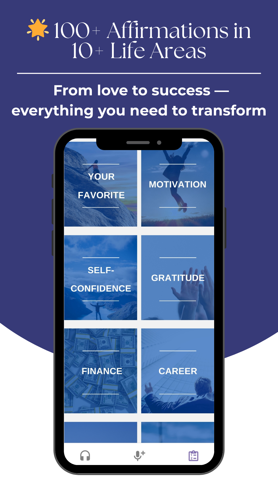
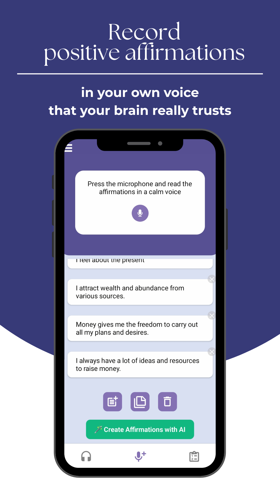
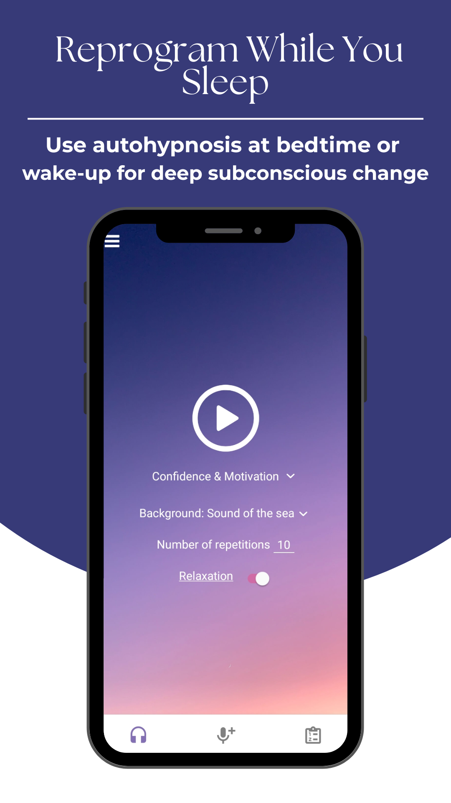
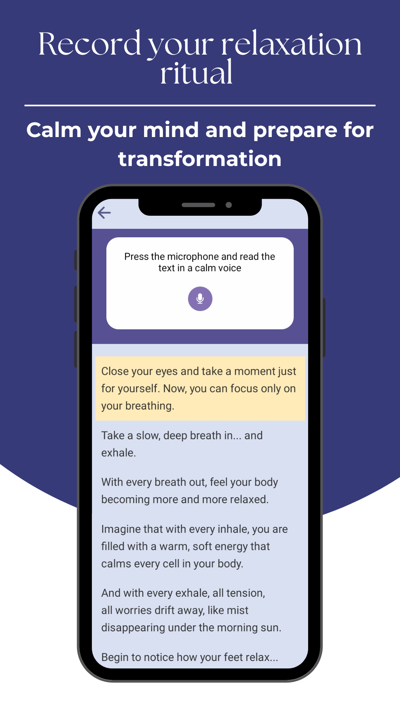

# 🎧 Positive Audio Affirmations

> A self-hypnosis mobile app for building positive habits through personalized voice affirmations.

[](https://play.google.com/store/apps/details?id=com.voiceapp.voice)
[](https://play.google.com/store/apps/details?id=com.voiceapp.voice)
[](https://reactnative.dev/)


## 📱 About

Positive Audio Affirmations helps users reprogram their subconscious mind through self-recorded voice affirmations. Based on psychological research showing that hearing your own voice creates stronger neural pathways than listening to others.

**I designed, developed, and launched this entire application independently** — from concept and UX design to Play Store publication and ongoing maintenance.

## ✨ Key Features

| Feature | Description |
|---------|-------------|
|🆕 **AI Voice Synthesis** | Integration with ElevenLabs API for ultra-realistic text-to-speech generation.
|**Dynamic Tier Limits** | Logic to handle API usage quotas based on user subscription status (Free/Pro).
| 🎙️ **Voice Recording** | Record personalized affirmations in your own voice |
| 📚 **100+ Affirmations** | Pre-written content across 10+ categories |
| 🤖 **AI Generator** | Smart affirmation suggestions based on user goals |
| 🔄 **Auto-Loop Mode** | Self-hypnosis playback during sleep or relaxation |
| 🎵 **Ambient Sounds** | Ocean waves, rain, fireplace, wind chimes |
| 🔔 **Smart Reminders** |Daily notifications |
| 🌍 **Multi-language** | Full support for English, Spanish, Russian |
| 💎 **Freemium Model** | Free tier with Premium subscription |

## 🛠️ Tech Stack

### Core Framework
```
React Native 0.78    
React 19.0           
JavaScript           
```

### State Management & Navigation
```
Redux + Redux Persist   
React Navigation 7      
AsyncStorage           
```

### Audio System
```
react-native-audio-recorder-player  │  Voice recording
react-native-sound                  │  Ambient sounds mixing
```

### Backend & Services
```
Firebase Analytics      │  User behavior tracking
RevenueCat              │  Subscription management
Notifee                 │  Local push notifications
Sentry                  │  Crash reporting & monitoring
ElevenLabs API          │ (Text-to-Speech)
DeepSeek API            │  AI Generator
```

### Localization
```
react-native-localize   │  Device locale detection
Custom i18n system      │  EN / ES / RU translations
```

## 🏗️ Architecture

```
┌────────────────────────────────────────────────────────────────┐
│                        PRESENTATION LAYER                      │
│  ┌──────────────┐  ┌──────────────┐  ┌──────────────┐          │
│  │  Onboarding  │  │    Tabs      │  │    Drawer    │          │
│  │    Wizard    │  │  Navigator   │  │   Navigator  │          │
│  └──────────────┘  └──────────────┘  └──────────────┘          │
│         │                 │                  │                 │
│  ┌──────┴─────────────────┴──────────────────┴──────┐          │
│  │                    SCREENS                        │         │
│  │  Listen │ Record │ Categories │ AI │ Relaxation  │          │
│  └──────────────────────────────────────────────────┘          │
├────────────────────────────────────────────────────────────────┤
│                        BUSINESS LAYER                          │
│  ┌─────────────┐  ┌─────────────┐  ┌─────────────────┐         │
│  │   Redux     │  │   Custom    │  │  Notification   │         │
│  │   Store     │  │   Hooks     │  │    Manager      │         │
│  └─────────────┘  └─────────────┘  └─────────────────┘         │
├────────────────────────────────────────────────────────────────┤
│                        SERVICE LAYER                           │
│  ┌────────┐ ┌────────┐ ┌──────────┐ ┌────────┐ ┌────────┐      │
│  │Firebase│ │Revenue │ │  Notifee │ │ Sentry │ │ Audio  │      │
│  │Analytics││  Cat   │ │          │ │        │ │ Player │      │
│  └────────┘ └────────┘ └──────────┘ └────────┘ └────────┘      │
├────────────────────────────────────────────────────────────────┤
│                        DATA LAYER                              │
│  ┌─────────────────┐  ┌─────────────────┐                      │
│  │  AsyncStorage   │  │  File System    │                      │
│  │  (Redux Persist)│  │  (Recordings)   │                      │
│  └─────────────────┘  └─────────────────┘                      │
└────────────────────────────────────────────────────────────────┘
```

## 🧩 Technical Challenges & Solutions

### 1. Complex Audio Management
**Challenge:** Handling simultaneous voice playback with ambient sounds, background audio, and interruptions (calls, notifications).

**Solution:** 
- Implemented custom audio focus management
- Used `react-native-track-player` for background playback with lock screen controls
- Created audio mixing system for layering ambient sounds over affirmations

### 2. Offline-First Architecture
**Challenge:** Users need full functionality without internet connection.

**Solution:**
- All voice recordings stored locally in app's document directory
- Redux Persist for offline state management
- Queue system for analytics events when offline
- Zero audio data uploaded to servers (privacy-first design)

### 3. Subscription Management
**Challenge:** Cross-platform subscription handling with trial limits and restore functionality.

**Solution:**
- RevenueCat integration for unified subscription management
- Custom paywall trigger logic based on app launches
- Automatic entitlement updates via listener pattern
- Smart reactivation notifications for churned users

### 4. Multi-language Support
**Challenge:** Supporting 3 languages with dynamic content and locale-specific UX.

**Solution:**
- Device locale detection via `react-native-localize`
- Centralized translation system with fallbacks
- Locale-aware notification content
- RTL-ready layout structure

### 5. Intelligent Notification System
**Challenge:** Driving engagement without being intrusive.

**Solution:**
- `Notifee` for reliable local notifications
- Motivational content rotation
- Separate reactivation campaign for non-subscribers

### 6. Managing High-Cost AI APIs & Quotas

**Challenge:** Implementing expensive AI text-to-speech features while maintaining a freemium model without bankrupting the project.

**Solution:**

Engineered a quota system on the frontend to strictly limit API calls (character/second limits) based on subscription tiers.

Implemented local caching: Generated audio files are saved to the file system (react-native-fs) with a hash map. If a user requests the same phrase again, the app plays the local file instead of calling the API, saving 100% of costs on repeats.

Fail-safe architecture: Usage limits are checked locally before any network request is initiated.

## 📸 Screenshots

<p align="center">
  
  
  
   
</p>


## 📊 Results & Metrics

| Metric | Value |
|--------|-------|
| 📥 Downloads | **5,000+** |
| ⭐ Rating | **4.0** (97 reviews) |
| 📱 Crash-free rate | **99.5%** |
| 🔄 Day-7 Retention | ~25% |
| 💳 Conversion to Premium | Confidential |

## 🔐 Privacy & Security

- **Zero audio uploads** — All voice recordings stay on device
- **No account required** — Full functionality without registration
- **GDPR compliant** — European privacy standards

## 🔗 Links

| Resource | Link |
|----------|------|
| 📲 Google Play | [Play Store](https://play.google.com/store/apps/details?id=com.voiceapp.voice) |
| 🔒 Privacy Policy | [Policy Page](https://xenia19.github.io/policy-app/policy.html) |
| 📧 Support | voice.app.n1@gmail.com |
| 👩‍💻 Developer | [Portfolio](https://xenia19.github.io/portfolio/) |

## 👩‍💻 About the Developer

I'm **Xenia**, a frontend and mobile developer based in Italy. I built this entire application from scratch — from initial concept to Play Store launch and ongoing updates.

**Why I built this:** With a background in **Psychology**, I understand how self-talk shapes our beliefs and behaviors. This app combines that knowledge with my technical skills to create a tool that genuinely helps people improve their mindset.

**What makes this project special:**
- 🎯 Designed, developed, and shipped **100% independently**
- 🔄 Continuous updates based on user feedback
- 📈 Organic growth to 5K+ downloads
- 💰 Profitable freemium business model

---

## ⚠️ Source Code

This repository contains **documentation and architecture overview only**. The source code is proprietary as this is an active commercial product.

## 📄 License

© 2025 Xenia Galaktionova. All rights reserved.
